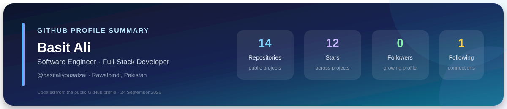

# Hi, I'm Basit Ali

### Software Engineer · Full-Stack Developer · Rawalpindi, Pakistan

I build scalable applications, dashboards, secure role-based systems, and practical backend APIs. My current focus is the .NET and Angular ecosystem, with a strong interest in clean architecture, maintainable code, and thoughtful user experiences.

## About me

- **2+ years** of experience developing scalable applications and dashboards.
- Currently working at **MultiTech Solutions** as a **Full Stack Developer**.
- Experienced with CMS platforms, desktop applications, web applications, reporting, and REST APIs.
- Continuously improving in **.NET Core, Angular, Crystal Reports, and cloud deployments**.
- Previously worked as a **Junior .NET Developer at Dev For Health SMC PVT LTD**.

## Technical toolkit

| Area | Technologies |
| --- | --- |
| **Backend and desktop** | .NET Core, MVC, Entity Framework, C#, Windows Forms, WebForms |
| **Frontend** | Angular, JavaScript, HTML, CSS, Bootstrap |
| **Databases** | SQL Server, MySQL, PostgreSQL, MongoDB |
| **Engineering focus** | Secure role-based systems, dashboards, REST APIs, reporting, maintainable architecture |

## Selected work

| Project | What it is | Links |
| --- | --- | --- |
| **BussinessAutomationSuite** | Business automation project | [Repository](https://github.com/basitaliyousafzai/BussinessAutomationSuite) |
| **Twinfinity** | Full-stack application project | [Repository](https://github.com/basitaliyousafzai/Twinfinity) |
| **clinicos-saas** | Clinic-focused SaaS project | [Repository](https://github.com/basitaliyousafzai/clinicos-saas) |
| **dr-zeryab-clinic** | Clinic website with appointment booking, services, testimonials, and patient-record management | [Repository](https://github.com/basitaliyousafzai/dr-zeryab-clinic) |
| **EcommerceWebsite** | ASP.NET MVC e-commerce store | [Repository](https://github.com/basitaliyousafzai/EcommerceWebsite) |
| **Protfolio** | Personal portfolio website | [Repository](https://github.com/basitaliyousafzai/Protfolio) · [Live website](https://basitali-one.vercel.app) |
| **TaskSharingPortal** | Collaboration and task-sharing project | [Repository](https://github.com/basitaliyousafzai/TaskSharingPortal) |
| **ProManagementSystem** | Management-system project | [Repository](https://github.com/basitaliyousafzai/ProManagementSystem) |

## GitHub profile snapshot

The live contribution calendar on GitHub is the most reliable source for activity because third-party activity-graph services can become unavailable. My current streak panel is shown below when the service is reachable:

## Let’s connect

> I enjoy turning complex requirements into reliable, maintainable software.

