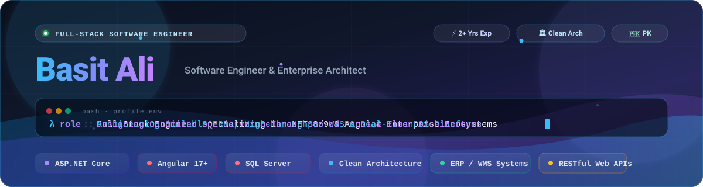
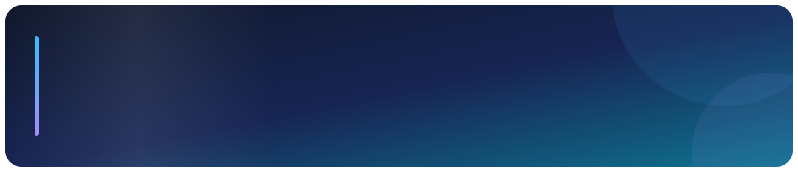
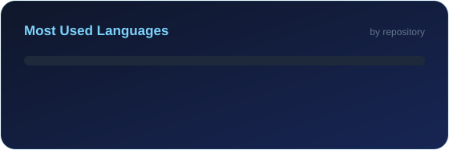

<!-- ═══════════════════════════════════════ HERO BANNER ═══════════════════════════════════════ -->
<div align="center">

<a href="https://github.com/basitaliyousafzai">
  
</a>

<br/>

<!-- Status & Experience Badges -->
<p align="center">
  <a href="https://github.com/basitaliyousafzai"></a>
  <a href="https://github.com/basitaliyousafzai?tab=followers"></a>
  <a href="https://www.linkedin.com/in/basit-ali-yousafzai/"></a>
  
  
</p>

<!-- Quick Navigation Bar -->
<p align="center">
  <a href="#about"></a> &bull;
  <a href="#experience"></a> &bull;
  <a href="#architecture"></a> &bull;
  <a href="#stack"></a> &bull;
  <a href="#enterprise"></a> &bull;
  <a href="#projects"></a> &bull;
  <a href="#analytics"></a> &bull;
  <a href="#connect"></a>
</p>

</div>


<!-- ═══════════════════════════════════════ ABOUT ═══════════════════════════════════════ -->
<h2 id="about">
  
  About Me
</h2>

<table>
<tr>
<td width="60%" valign="top">

Hello! I'm **Basit Ali**, a dedicated **Full-Stack Software Engineer** based in Rawalpindi, Pakistan with over **2+ years of professional experience** engineering enterprise web solutions, high-throughput backends, and responsive user experiences.

- 💼 **Full-Stack Developer** at **Multi-Tech Solutions**
- 🏛️ **Full-Stack .NET Consultant** for **HOAP** (Hajj Organizers Association of Pakistan)
- ⚙️ **Backend Engineering:** ASP.NET Core · C# · RESTful Web APIs · Entity Framework Core
- 🎨 **Frontend Engineering:** Angular 17+ · TypeScript · RxJS · React · Modern CSS
- 🗄️ **Database Architecture:** Microsoft SQL Server schema modeling, complex stored procs & query performance tuning
- 📐 **Software Principles:** Clean Architecture · SOLID · Repository & Unit of Work · Role-Based Access Control (RBAC)

</td>
<td width="40%" align="center" valign="middle">


</td>
</tr>
</table>

<details>
<summary><b>👨‍💻 &nbsp;View Developer Profile (C# Object Definition)</b></summary>
<br/>

```csharp
namespace Portfolio.BasitAli;

public sealed record EngineerProfile : SoftwareEngineer
{
    public string   FullName       { get; init; } = "Basit Ali";
    public string   Location       { get; init; } = "Rawalpindi, Pakistan 🇵🇰";
    public string   CurrentRole    { get; init; } = "Full-Stack Software Engineer";
    public string   Experience     { get; init; } = "2+ Years Enterprise Delivery";

    public string[] Backend        { get; init; } = ["C#", "ASP.NET Core", "Web API", "EF Core", "LINQ"];
    public string[] Frontend       { get; init; } = ["Angular", "TypeScript", "RxJS", "React", "TailwindCSS"];
    public string[] Databases      { get; init; } = ["SQL Server", "PostgreSQL", "MySQL", "Redis"];
    public string[] Architecture   { get; init; } = ["Clean Architecture", "SOLID", "RBAC", "Repository Pattern"];

    public string   Specialization { get; init; } = "Supply Chain WMS, Retail ERPs, Healthcare & FinTech Portals";
    public string   Motto          { get; init; } = "Engineering resilient, high-performance systems that empower businesses.";
}
```

</details>


<!-- ═══════════════════════════════════════ ARCHITECTURAL PILLARS ═══════════════════════════════════════ -->
<h2 id="architecture">
  
  Core Engineering Pillars
</h2>

<table>
<tr>
<td width="25%" valign="top">
<h4>🏗️ Clean Architecture</h4>
<p>Strict separation of concerns across Domain, Application, Infrastructure, and Presentation layers for maintainable enterprise systems.</p>
</td>
<td width="25%" valign="top">
<h4>⚡ High-Throughput SQL</h4>
<p>Execution plan analysis, index optimization, deadlock reduction, and tuned stored procedures in Microsoft SQL Server.</p>
</td>
<td width="25%" valign="top">
<h4>🛡️ RBAC &amp; Security</h4>
<p>Granular Role-Based Access Control, JWT authentication tokens, audit logging, and data-integrity protection pipelines.</p>
</td>
<td width="25%" valign="top">
<h4>📦 Enterprise Logistics</h4>
<p>Deep domain expertise in Warehouse Management Systems (WMS), point-of-sale (POS), and automated inventory reconciliation.</p>
</td>
</tr>
</table>


<!-- ═══════════════════════════════════════ WORK EXPERIENCE ═══════════════════════════════════════ -->
<h2 id="experience">
  
  Work Experience
</h2>

<table>
<tr>
<td width="150" align="center" valign="top">
<br/>
<sub>🟢 <b>Current Role</b></sub>
</td>
<td valign="top">

### Full-Stack Developer · [Multi-Tech Solutions](https://www.linkedin.com/company/multi-tech-solutions/)

- Architect and maintain enterprise-grade web applications, **warehouse logistics (WMS)**, and **retail e-commerce** platforms.
- Design database architectures and write performance-critical **Microsoft SQL Server** stored procedures handling high transactional loads.
- Build reactive, modular client dashboards using **Angular**, **TypeScript**, RxJS, and modern responsive CSS frameworks.

</td>
</tr>
<tr>
<td width="150" align="center" valign="top">
<br/>
<sub>🟣 <b>Consulting</b></sub>
</td>
<td valign="top">

### Full-Stack .NET Developer · [HOAP](https://www.hoap.org.pk) *(Hajj Organizers Association of Pakistan)*

- Lead development of member management modules, pilgrimage quota tracking, and audit approval workflows.
- Implemented strict **Role-Based Access Control (RBAC)** and optimized LINQ / Entity Framework Core data queries.

</td>
</tr>
<tr>
<td width="150" align="center" valign="top">
<br/>
<sub>⚪ <b>Previous</b></sub>
</td>
<td valign="top">

### Junior .NET Developer · Dev For Health SMC (Pvt) Ltd

- Developed healthcare software and clinical workflows utilizing **C#**, **Windows Forms**, **ASP.NET WebForms**, and **SQL Server**.
- Implemented automated diagnostic report generators, role security enhancements, and prescription record tracking modules.

</td>
</tr>
</table>


<!-- ═══════════════════════════════════════ TECH STACK ═══════════════════════════════════════ -->
<h2 id="stack">
  
  Tech Stack &amp; Skills
</h2>

<div align="center">

<table>
<tr>
<td align="center" width="25%">
<b>⚙️ Backend</b><br/><br/>

</td>
<td align="center" width="25%">
<b>🎨 Frontend</b><br/><br/>

</td>
<td align="center" width="25%">
<b>🗄️ Databases</b><br/><br/>

</td>
<td align="center" width="25%">
<b>🧰 Tools &amp; DevOps</b><br/><br/>

</td>
</tr>
<tr>
<td align="center" colspan="4">
<b>💅 Styling &amp; UI Frameworks:</b> &nbsp;

</td>
</tr>
</table>

</div>

<details>
<summary><b>🏷️ &nbsp;Comprehensive Technology &amp; Tool Badges</b></summary>
<br/>

| Domain | Technologies &amp; Frameworks |
| :--- | :--- |
| **Backend &amp; APIs** |        |
| **Frontend** |       |
| **Databases** |      |
| **Tools &amp; DevOps** |       |
| **Patterns &amp; Architecture** |      |

</details>


<!-- ═══════════════════════════════════════ ENTERPRISE WORK ═══════════════════════════════════════ -->
<h2 id="enterprise">
  
  Commercial &amp; Enterprise Projects
</h2>

<p><i>Production solutions engineered for enterprise clients &mdash; live and actively serving operations:</i></p>

<table>
  <tr>
    <td width="50%" valign="top">
      <h3>🕋 <a href="https://www.hoap.org.pk">HOAP Platform</a></h3>
      <p><b>Role:</b> Full-Stack .NET Developer &nbsp;&bull;&nbsp; <b>Client:</b> Hajj Organizers Association of Pakistan</p>
      <ul>
        <li>Core management modules for member organizations, pilgrimage quota tracking, and audit workflows.</li>
        <li>Implemented strict Role-Based Access Control (RBAC) and optimized LINQ / EF Core data access.</li>
      </ul>
      <p><code>ASP.NET MVC</code> <code>C#</code> <code>Entity Framework</code> <code>SQL Server</code></p>
      <a href="https://www.hoap.org.pk"></a>
    </td>
    <td width="50%" valign="top">
      <h3>📦 <a href="https://hbwh.dwatson.co">HBWH Dwatson &mdash; WMS</a></h3>
      <p><b>Role:</b> Backend Developer &nbsp;&bull;&nbsp; <b>Company:</b> Multi-Tech Solutions</p>
      <ul>
        <li>Warehouse automation platform managing real-time inventory tracking, dispatching, and rack assignments.</li>
        <li>Sub-second barcode scan processing and automated audit reconciliation routines.</li>
      </ul>
      <p><code>ASP.NET Core</code> <code>C#</code> <code>SQL Server</code> <code>JavaScript</code></p>
      <a href="https://hbwh.dwatson.co"></a>
    </td>
  </tr>
  <tr>
    <td width="50%" valign="top">
      <h3>🛒 <a href="https://dwatson.co">Dwatson.co E-Commerce</a></h3>
      <p><b>Role:</b> Full-Stack Developer &nbsp;&bull;&nbsp; <b>Company:</b> Multi-Tech Solutions</p>
      <ul>
        <li>Large-scale retail pharmacy and consumer store catalog with thousands of SKUs and dynamic filters.</li>
        <li>Engineered cart checkout pipelines, customer accounts, and administrative inventory controls.</li>
      </ul>
      <p><code>ASP.NET MVC</code> <code>C#</code> <code>SQL Server</code> <code>CSS3</code></p>
      <a href="https://dwatson.co"></a>
    </td>
    <td width="50%" valign="top">
      <h3>🍽️ <a href="https://bk.mtsapp.net">ButtKarahi POS Admin</a></h3>
      <p><b>Role:</b> Full-Stack Developer &nbsp;&bull;&nbsp; <b>Company:</b> Multi-Tech Solutions</p>
      <ul>
        <li>Real-time restaurant operations system coordinating kitchen tickets (KOT), table orders, and billing.</li>
        <li>Eliminated cashier manual entry errors through automated price calculations.</li>
      </ul>
      <p><code>ASP.NET MVC</code> <code>C#</code> <code>SQL Server</code> <code>Bootstrap</code></p>
      <a href="https://bk.mtsapp.net"></a>
    </td>
  </tr>
</table>

<details>
<summary><b>➕ &nbsp;Additional Commercial Deployments</b></summary>
<br/>

| Project | Description | Stack | Link |
| :--- | :--- | :--- | :---: |
| 🏭 **Margalla Packages Industry** | Corporate industrial manufacturing site with product showcase, inquiries & quote estimates. | `ASP.NET MVC` `SQL Server` | [](https://www.margallapackagesindustry.com) |
| 🏭 **Nadeem Plastic &amp; Nadir Brothers** | Corporate product catalogues and B2B communication portals for manufacturing companies. | `ASP.NET MVC` `C#` `Bootstrap` | [](https://nadeemplastic.com) |

</details>


<!-- ═══════════════════════════════════════ OPEN SOURCE (AUTO-SYNCED) ═══════════════════════════════════════ -->
<h2 id="projects">
  
  Open-Source &amp; Featured Repositories
</h2>

<p>
  
  &nbsp;<i>Automatically synchronized with GitHub API &mdash; new public repositories appear here automatically:</i>
</p>

<!-- PROJECTS:START -->
<!-- ⚠️ Auto-generated by .github/scripts/update-readme.mjs — edits here will be overwritten. -->
<table>
<tr>
<td width="50%" valign="top">
<h3>📊 <a href="https://github.com/basitaliyousafzai/ChartOfAccount">Chart Of Account &amp; General Ledger ERP</a></h3>
<p>Autonomous Chart of Accounts &amp; General Ledger ERP engine with offline Electron desktop, integer-cent double-entry bookkeeping, and zero-tolerance balance verification.</p>
<p><code>erp</code> <code>accounting</code> <code>double-entry</code> <code>electron</code> <code>desktop</code></p>
<p>  </p>
<a href="https://github.com/basitaliyousafzai/ChartOfAccount"></a>
</td>
<td width="50%" valign="top">
<h3>🛒 <a href="https://github.com/basitaliyousafzai/EcommerceWebsite">E-Commerce Web Platform</a></h3>
<p>Full-featured ASP.NET MVC e-commerce platform with dynamic product catalogs, cart pipeline, user authentication, and SQL Server persistence.</p>
<p><code>csharp</code> <code>dotnet</code> <code>aspnet-mvc</code> <code>ecommerce</code> <code>sql-server</code></p>
<p>   </p>
<a href="https://github.com/basitaliyousafzai/EcommerceWebsite"></a>
</td>
</tr>
<tr>
<td width="50%" valign="top">
<h3>📥 <a href="https://github.com/basitaliyousafzai/OmniDownloader">Omni Downloader</a></h3>
<p>High-speed multi-resource downloader utility designed for stream handling, batch jobs, and effortless media downloads.</p>
<p><code>javascript</code> <code>downloader</code> <code>utilities</code> <code>automation</code></p>
<p>  </p>
<a href="https://github.com/basitaliyousafzai/OmniDownloader"></a>
</td>
<td width="50%" valign="top">
<h3>🌐 <a href="https://github.com/basitaliyousafzai/Protfolio">Portfolio Web Application</a></h3>
<p>Interactive developer portfolio web app showcasing full-stack enterprise projects, skill stack, and commercial solutions.</p>
<p><code>portfolio</code> <code>javascript</code> <code>html5</code> <code>css3</code> <code>vercel</code></p>
<p>   </p>
<a href="https://github.com/basitaliyousafzai/Protfolio"></a> <a href="https://basitali-one.vercel.app"></a>
</td>
</tr>
<tr>
<td width="50%" valign="top">
<h3>🦷 <a href="https://github.com/basitaliyousafzai/Dental">Dental Clinic Portal</a></h3>
<p>Healthcare dental practice management portal for patient appointments, treatment tracking, and dentist schedules.</p>
<p><code>healthcare</code> <code>dental-portal</code> <code>javascript</code> <code>clinic-system</code></p>
<p>  </p>
<a href="https://github.com/basitaliyousafzai/Dental"></a>
</td>
<td width="50%" valign="top">
<h3>💻 <a href="https://github.com/basitaliyousafzai/Portfolio">Developer Showcase Portfolio</a></h3>
<p>Responsive personal engineering showcase exhibiting software engineering capabilities, frontend components, and UI layouts.</p>
<p><code>javascript</code> <code>portfolio</code> <code>frontend</code> <code>responsive-web</code></p>
<p>  </p>
<a href="https://github.com/basitaliyousafzai/Portfolio"></a>
</td>
</tr>
<tr>
<td width="50%" valign="top">
<h3>🏥 <a href="https://github.com/basitaliyousafzai/clinicsync">ClinicSync Management Suite</a></h3>
<p>Comprehensive clinic management system managing patient health records, appointment bookings, and physician schedules.</p>
<p><code>php</code> <code>clinic-management</code> <code>ehr</code> <code>healthcare</code> <code>appointments</code></p>
<p>   </p>
<a href="https://github.com/basitaliyousafzai/clinicsync"></a>
</td>
<td width="50%" valign="top">
<h3>📋 <a href="https://github.com/basitaliyousafzai/ProManagementSystem">Pro Management System</a></h3>
<p>Enterprise multi-role organization and workflow management portal featuring administrative dashboards and team coordination.</p>
<p><code>csharp</code> <code>sql-server</code> <code>management-system</code> <code>rbac</code> <code>dashboard</code></p>
<p>  </p>
<a href="https://github.com/basitaliyousafzai/ProManagementSystem"></a>
</td>
</tr>
<tr>
<td width="50%" valign="top">
<h3>✨ <a href="https://github.com/basitaliyousafzai/BasitAliPortfolio">Basit Ali Portfolio Site</a></h3>
<p>Personal branding and web portfolio highlighting full-stack .NET and Angular engineering competencies.</p>
<p><code>portfolio</code> <code>html5</code> <code>css3</code> <code>software-engineer</code></p>
<p>  </p>
<a href="https://github.com/basitaliyousafzai/BasitAliPortfolio"></a>
</td>
<td width="50%" valign="top"></td>
</tr>
</table>
<!-- PROJECTS:END -->

<p align="center">
  <a href="https://github.com/basitaliyousafzai?tab=repositories"></a>
</p>


<!-- ═══════════════════════════════════════ GITHUB ANALYTICS ═══════════════════════════════════════ -->
<h2 id="analytics">
  
  GitHub Analytics &amp; Activity
</h2>

<div align="center">

<!-- Self-Hosted Profile Summary Card -->


<br/><br/>

<table>
<tr>
<td width="50%" align="center" valign="middle">
<a href="https://github.com/basitaliyousafzai">
  
</a>
</td>
<td width="50%" align="center" valign="middle">
<!-- Self-Hosted Top Languages Breakdown -->

</td>
</tr>
</table>

<br/>

<!-- Real-Time Contribution Snake -->
<picture>
  <source media="(prefers-color-scheme: dark)" srcset="https://raw.githubusercontent.com/basitaliyousafzai/basitaliyousafzai/output/github-snake-dark.svg" />
  <source media="(prefers-color-scheme: light)" srcset="https://raw.githubusercontent.com/basitaliyousafzai/basitaliyousafzai/output/github-snake.svg" />
  
</picture>

</div>


<!-- ═══════════════════════════════════════ VALUE PROPOSITION ═══════════════════════════════════════ -->
<h2>
  
  What I Deliver to Teams &amp; Clients
</h2>

<table>
<tr>
<td width="33%" align="center" valign="top">
<br/>
<b>Scalable Architecture</b><br/>
<sub>Clean, modular .NET backends engineered to scale gracefully as business demands increase.</sub>
</td>
<td width="33%" align="center" valign="top">
<br/>
<b>Performance First</b><br/>
<sub>Tuned SQL Server stored procedures, optimal indexes, and low-latency API response times.</sub>
</td>
<td width="33%" align="center" valign="top">
<br/>
<b>Polished UX</b><br/>
<sub>Reactive Angular dashboards with intuitive workflows that users love to navigate.</sub>
</td>
</tr>
</table>


<!-- ═══════════════════════════════════════ CONNECT ═══════════════════════════════════════ -->
<h2 id="connect">
  
  Let's Connect &amp; Collaborate
</h2>

<div align="center">

<p><i>Always open to discussing new opportunities, enterprise consulting, and innovative software engineering projects.</i></p>

<p align="center">
  <a href="https://www.linkedin.com/in/basit-ali-yousafzai/"></a>
  <a href="mailto:basitaliyousafzai786@gmail.com"></a>
  <a href="https://basitali-one.vercel.app"></a>
  <a href="https://github.com/basitaliyousafzai"></a>
</p>

<br/>

<blockquote>
<i>"Software engineering is not just about writing code &mdash; it's about engineering resilient solutions that empower organizations and people."</i>
</blockquote>

<br/>

<!-- Self-Hosted Footer Wave Banner -->


</div>
